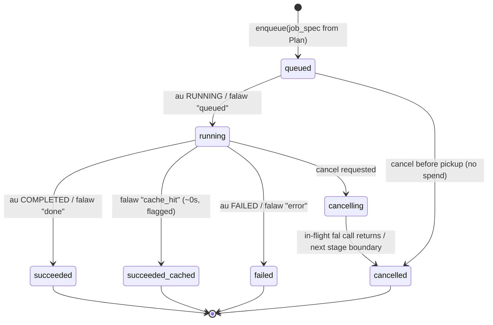
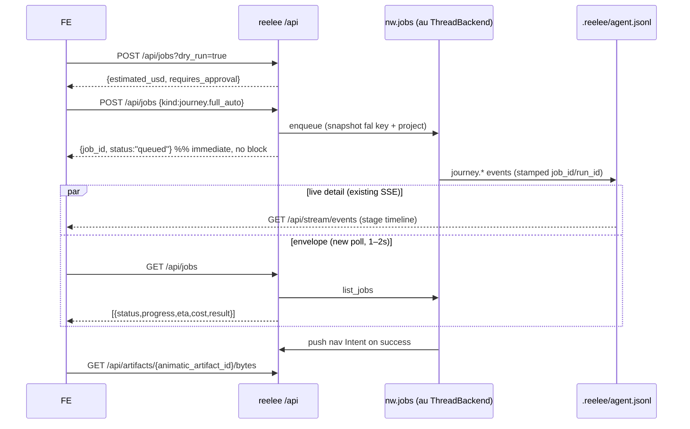

# Async Job Manager for reelee — `nw.jobs` on `au`

**A design report for the agent building `nw.jobs`.**
Scope: reelee#182 (a durable `/api/jobs` surface) and reelee-web#159 (a task-tray with real progress, ETA, and cancel). The deliverable is a new module `nw.jobs` in the `nw` package, built on `au`, mounted by reelee via `qh` at `/api/jobs`, and consumed by reelee-web's task tray.

---

## 1. Context + goal

### What #182 and #159 ask for

Two symptoms, one root cause.

- **#182** wants a first-class **job** resource: submit a billable render and get an id back *immediately* (no spend-on-click block), then poll `/api/jobs/{id}` for status, progress, ETA, cost, and — on success — the artifact. Plus list and cancel.
- **#159** wants the reelee-web **task tray** to show a live progress bar with an honest ETA and a cancel button that actually clears the toast.

Today neither exists, and the reason is structural: **a "render job" is not an object — it is an HTTP request.** `reelee/server.py::post_journey_full_auto` / `post_render_final_cut` (server.py:1894, :1295) are synchronous route handlers that call `_render_final_cut(...)` inline and block a threadpool worker for the whole multi-minute chain. The only job identity is the live request; the only cancel channel is `reelee/journey_control.py` — a **process-local `set[str]` of project roots** checked only at stage boundaries (edits.py:1085). Nothing about the job survives the process. If the server bounces or the request is lost, `journey.finished` never fires, the FE task-tray toast (fed by `agent_log` → SSE `/api/stream/events`) has no terminal event, and the cancel button flips a flag in a `set` that no longer exists. That is the un-cancellable stuck-toast bug (#144/#147) exactly.

### The thin-reelee constraint (obey it)

reelee must stay **thin and add no async substance.** The job manager lives in **`nw` (`nw.jobs`)**, built on **`au`** (the async framework at `$PP/i/au`), mounted by reelee via **`qh`** at `/api/jobs`, and consumed by **reelee-web**'s task tray. This mirrors the federation rule that audio lives in `braidio`/`foley`, not in reelee: reelee owns route wiring + serialization only; every thread, store, retry, poll loop, and state-machine lives below it.

| Layer | Owns |
|---|---|
| **`au`** (`i/au`) | the async primitive: durable `ComputationStore`, pluggable backends, `submit`/`status`/`cancel`. **Foundation — extend, don't inline.** |
| **`nw.jobs`** (new) | a project-scoped job facade over `au`: enqueue/list/get/cancel, the 5-state normalization, progress/ETA/cost derivation, context-capture so a job outlives its request, the `job_id⇆run_id` correlation. **All async substance.** |
| **`reelee`** | four thin closures in `_build_routes` + a `kind → callable` dispatch table. No threads, no store, no polling. |
| **`reelee-web`** | a poll hook reconciled with the existing SSE stream; the tray reads progress/ETA/cost/terminal-state from the job record. |

---

## 2. Why `au` (and when to outgrow it)

reelee runs on **one always-on, memory-fragile box (3.7 GB RAM)**, serves **a single tenant**, keeps state in **`dol`/file-backed stores**, and does its heavy lifting by **firing long GPU renders at fal.ai over HTTP**. That last point is the crux: the "work" is not CPU-bound fan-out across cores — it is *awaiting an upstream job*. The right execution unit is a cheap in-process worker that holds an HTTP call, persists a handle, can be cancelled, retries on a transient 5xx, and survives a restart by reading the handle back off disk.

That is exactly what **`au`** provides: `ThreadBackend`/`ProcessBackend`/`StdLibQueueBackend`, a dol-style `FileSystemStore`, plus `cancel_task`, `retry_with_policy`, and observability middleware — with a **zero-dependency stdlib core**. It runs *inside* the already-running HTTP server; no daemon, no broker.

Every mainstream alternative is built for a problem reelee does not have — a fleet of CPU-bound workers coordinating through a shared broker — and pays for it with an always-on service and separate worker processes this box specifically cannot spare (abandoned processes have already OOM'd it once).

| Tool | Needs to run | New always-on footprint | Justified here? |
|---|---|---|---|
| **au** | Nothing — in-process, stdlib core, `Mapping`-backed persistence | None (threads in the existing server process) | ✅ Matches the workload, the RAM budget, the file-first storage stance |
| **arq** [1] | **Redis** + separate async worker process(es) | Redis daemon + worker(s) | ❌ Broker + daemon for no gain; renders are I/O-bound |
| **RQ** [1] | **Redis** + fork-based worker processes (POSIX) | Redis + forked workers (each re-imports the app) | ❌ Forked workers each carry a full copy of reelee's heavy deps — the exact RAM multiplier to avoid |
| **Dramatiq** [2] | **RabbitMQ/Redis** broker + worker processes | Broker (RabbitMQ = an Erlang VM, hundreds of MB) + workers | ❌ Actor/reliability model shines with a real broker + many workers |
| **Celery** [1][2] | **Broker + result backend** + worker daemon(s); Beat for cron | Broker + result backend + daemons + large dep tree | ❌ Max operational/memory weight, aimed at multi-host fan-out |
| **Huey** [3] | Redis default; `SqliteHuey`/`FileHuey` avoid the broker, but real async still runs a **separate consumer process** | A consumer daemon (broker optional) | ⚠️ Closest in spirit — genuinely broker-light — but still a second long-lived process, storage not dol-native |
| **Temporal** [4][5] | A **Temporal Server cluster (Go) + a database** + workers; or Cloud (~$200/mo) | An entire cluster + DB, or a hosted dependency | ❌ Gold-standard durable cross-host replay, wildly out of proportion for one box |

**Being fair:** Huey's `SqliteHuey`/immediate mode, Dramatiq's actor model, and Temporal's event-history replay are real engineering — they solve *distribution and multi-worker durability*, which reelee has deliberately deferred. The moment reelee needs those properties, the calculus flips. It doesn't yet.

**So `au` is the right default now:** no broker, no RAM-hungry daemon competing with fal-bound render threads, persistence through a plain `Mapping` (consistent with the dol/file-backed stance and offline-friendliness), and `cancel` + `retry` + middleware already present. It is the smallest thing that does the whole job.

**When reelee outgrows `au` — the exact conditions:**

1. **Multi-worker horizontal scale** — more concurrent renders than one process should babysit, or a second box, needing a *shared* queue across processes/hosts.
2. **Cross-host durability / at-least-once delivery** — jobs must survive the box dying and *resume elsewhere* from broker-held, acknowledged state.
3. **Cron / scheduled fan-out** — periodic `regen`, scheduled batch passes wanting a real scheduler.
4. **Multi-tenant fairness** — once metered prepaid billing (reelee#146) brings concurrent users, per-tenant priority/quotas/rate-limiting across a shared queue.

**The migration seam:** reelee never calls `au` directly — it consumes execution through **`nw.jobs`**, and `au` is merely the *default backend* behind that boundary. Swapping the backend is a change **in `nw`, not reelee**. And the first step out may not even leave `au`: it already ships an **RQ/Redis** backend and a **Supabase** backend alongside Thread/Process/StdLibQueue, and `FileSystemStore` is swappable for a Redis/DB store — "single box → Redis-shared queue" is a config swap under the same API. Only condition **2** and stronger justify graduating past `au` entirely, at which point `nw.jobs` gets a Temporal- or broker-backed implementation and reelee's code stays untouched.

---

## 3. `au` fit — what `au` gives, what `nw.jobs` must add

`au` supplies the submit→poll→result skeleton and pluggable persistence, but nothing render-domain-specific. Precise map below, cited to real code.

### 3.1 Submission surfaces

Two coherent surfaces plus batch:

- **Decorator** — `async_compute(backend=None, store=None, *, base_path="/tmp/computations", ttl_seconds=3600, serialization=SerializationFormat.JSON, middleware=None) -> Callable` (base.py:987). The wrapped call returns immediately: `key = store.create_key(); backend.launch(func, args, kwargs, key); return ComputationHandle(key, store)` (base.py:1029-1032). This is the **internally-consistent path** — `launch` is called with exactly the 4 args its signature declares (base.py:630). ⚠️ **But the handle it returns has `backend=None`** (`ComputationHandle(key, store)`, base.py:1032): its `.cancel()` flips the store record but **cannot call `terminate()`**, which only fires when `self.backend` is set (base.py:976-977). So the decorator path does **not** give the process-kill behavior for free.
- **Function** — `submit_task(func, *args, backend=None, store=None, retry_policy=None, **kwargs) -> str` returns the task-id key (api.py:117-160). ⚠️ **Signature-drifted from `base.py`:** it calls `backend.launch(func, args, kwargs, key, store)` with a 5th `store` arg (api.py:158) that no backend accepts, and `_get_default_backend()` constructs `ProcessBackend()` with no `store` (required, base.py:732) and `StdLibQueueBackend(max_workers=..., executor_type="thread")` with a kwarg that doesn't exist (real kwarg is `use_processes`, base.py:806-816) — and `RQBackend(redis_url=redis_url)` (api.py:44) where the real signature is `RQBackend(store, rq_queue, middleware)` (rq_backend.py:49). Treat `submit_task`/`async_task`/`submit_many` as **not currently wired to the `base.py` backends**.
- **Context manager** — `async_task(...)` submits on enter, blocks for the result on exit (api.py:264-313).
- **Batch** — `submit_many(...)` is a loop over `submit_task` (api.py:340-370) — inherits the same drift.

> **Build recommendation:** `nw.jobs` should drive `backend.launch(...)` + `ComputationHandle` directly (the decorator path), **not** the un-wired `submit_task` helpers — *or* fix `api.py` first (see §8, an upstream candidate). **When it builds the handle it must pass the backend explicitly** — `ComputationHandle(key, store, backend)`, exactly as `api.cancel_task` does (api.py:260) — otherwise `cancel()` degrades to store-flip-only even on `ProcessBackend`/`StdLibQueueBackend`, where `terminate()` would otherwise do real work. This report assumes the decorator/`launch` path *with the backend threaded into the handle*.

**`ComputationHandle`** (`@dataclass`, base.py:898): fields `key: str`, `store: ComputationStore`, `backend: ComputationBackend | None`; `is_ready()` (:912); `get_status() -> ComputationStatus` (:916); `get_result(*, timeout=None) -> T` — adaptive-interval blocking poll, `TimeoutError` on expiry, `RuntimeError` on FAILED (:920-961); `cancel() -> bool` (:963); `metadata` property → `store[key].metadata` (:981).

### 3.2 State + results

- **`ComputationStatus(Enum)`**: `PENDING`, `RUNNING`, `COMPLETED`, `FAILED` (base.py:200-206). **No `CANCELLED`** — cancel reuses `FAILED` with `error=Exception("Computation cancelled")` (base.py:973).
- **`ComputationResult`** (`@dataclass`, base.py:216): `value, status, error, created_at, completed_at, metadata: dict[str,Any]`. `is_ready` = COMPLETED|FAILED (:233); `duration` computed **only after** `completed_at` is set (:238-243).
- **`ComputationStore(MutableMapping[str, ComputationResult], ABC)`** (base.py:249) — the store *is* a dol-compatible mapping; abstract `create_key()`, `get_reconstruction_info()`, `cleanup_expired()`, plus `ttl_seconds`/`is_expired`. **`FileSystemStore`** (base.py:289) persists each result as one JSON/pickle file (`base_path/{uuid}{suffix}`), written atomically via tmp-file `replace` (:418-421), random probabilistic TTL cleanup (:340-346).
  - **Gotcha 1:** a missing key returns `ComputationResult(None, PENDING)` rather than raising (:390-391), so `key in store` is effectively always true and there's no way to distinguish "never submitted" from "pending." `nw.jobs` must track its own set of live job ids (the active-jobs index, §6).
  - **Gotcha 2:** status is only ever written by the worker — nothing reaps a task that was `RUNNING` when the box crashed, so an in-flight render orphans as permanent `RUNNING` across restarts. `nw.jobs` (or `au`, §8) must add a heartbeat/reaper.

### 3.3 Backends — which fits blocking, network-bound fal on one box

- **`ThreadBackend`** (base.py:1045) — one bare `threading.Thread` per task (:1060-1081), state written to the shared store. **Best fit for the blocking-HTTP-wait shape of a fal render** (I/O-bound), and it shares the live in-process `Project` graph and writes to the same `.reelee/agent.jsonl` the SSE tails. But: no pool/concurrency cap (unbounded threads), and **no `terminate` override** → inherits the base no-op (:639), so it is **uncancellable** at the thread level.
- **`StdLibQueueBackend`** (base.py:798) — `concurrent.futures` pool, `max_workers` (:806-827), `use_processes=True/False`. With `use_processes=False` this is the recommended fal fit **when bounded concurrency matters**: threads for the network wait *plus* a worker pool that caps concurrent (paid) renders. Still shares the process (so the live graph + agent.jsonl work), but results-only durability via the store (`_futures` dict is in-memory).
- **`ProcessBackend`** (base.py:729, default of `async_compute`) — one forked process per task (:740-789). Its one real advantage is genuine mid-flight cancellation (SIGTERM). But it is CPU/memory-heavy on a 3.7 GB box, **cannot share the live `Project` graph or write to the same live agent.jsonl channel** the SSE tails, and each fork re-imports reelee's heavy deps. For pure network waits it's overkill *and* it breaks the live-progress channel.
- `RemoteAPIBackend` (base.py:1084) is a `NotImplementedError` skeleton (:1116) — *not* a fal integration despite the name.

### 3.4 Cancellation (per backend)

`ComputationHandle.cancel()` (base.py:963-979) marks the store `FAILED("Computation cancelled")` if not already ready, then — **only if the handle carries a backend** (`self.backend`, base.py:976-977) — calls `backend.terminate(key)`. (This is why §3.1 insists `nw.jobs` construct `ComputationHandle(key, store, backend)`; a `backend=None` handle skips `terminate` entirely.) When it does reach a backend:

- `ProcessBackend.terminate` → `proc.terminate(); proc.join()` — SIGTERM kill mid-render (:791-795). *But fal keeps running the GPU job upstream and still bills.*
- `StdLibQueueBackend.terminate` → `future.cancel()` — **only cancels if not yet started** (:854-859).
- `ThreadBackend` / base → **no-op** (:639-641); the store says FAILED but the fal call runs to completion (and still bills).

**The one unconditional, immediate, cross-backend guarantee:** `cancel()` flips the **store record** to a terminal state *before* it even reaches `terminate` (base.py:970-978). That is the load-bearing property — the job's observable state goes terminal even when the worker can't be stopped (and even when the handle has no backend). On the recommended thread/queue backends, cancel is therefore **advisory**: the store flips, the upstream fal job is not stopped (see §6 for how this still kills the stuck-toast bug, and §8 for the falaw `request_id` path that makes cancel *truly* stop spend).

### 3.5 Retry

`RetryPolicy` (`@dataclass`, retry.py:23-95): `max_attempts, backoff, initial_delay, max_delay, retry_on, dont_retry_on, on_retry`; `should_retry(attempt, error)` + `get_delay(attempt)`. `BackoffStrategy(str, Enum)` = `EXPONENTIAL|LINEAR|CONSTANT` (:15-20). `retry_with_policy(func, args, kwargs, policy)` is a **synchronous, blocking** loop (`time.sleep`, :191) that runs *inside the worker thread/process*. Named policies: `DEFAULT_`, `AGGRESSIVE_`, `CONSERVATIVE_`, `NETWORK_RETRY_POLICY` (the last already scoped to `ConnectionError/TimeoutError`, excluding `ValueError/TypeError`, retry.py:229-236 — closest to a fal-transient policy). **Caveat:** retry is only injected via the drifted `submit_task` path (api.py:149-155); the decorator path applies no retry, so `nw.jobs` must wrap the fal call with `retry_with_policy` itself.

### 3.6 Middleware (hook points)

`Middleware(ABC)` (base.py:465): `before_compute(func, args, kwargs, key)`, `after_compute(key, result)`, `on_error(key, error)` — **lifecycle boundaries only**, and these are the signatures the backends actually invoke (base.py:647-671). `LoggingMiddleware` (:486) and `MetricsMiddleware` (:514, `get_stats() → {total, completed, failed, avg_duration}`) implement them; `SharedMetricsMiddleware` (:565) uses `multiprocessing.Value` for cross-process counters. **There is no mid-computation hook** — nowhere to emit a heartbeat/progress tick while a 5-min render runs. `nw.jobs` mirrors falaw's own per-call `ProgressEvent`s into the store metadata instead (§5).

⚠️ **`au` also ships a *second, parallel* middleware layer — `au/hooks.py` — that is unwired.** It is exported from `au.__init__` (au/__init__.py:83-90): `HooksMiddleware`, `TracingMiddleware`, `MetricsCollectorMiddleware`, `CompositeMiddleware`, `TaskEvent`, `create_observability_middleware`. But these define **different, incompatible signatures** — `before_compute(self, func_name, args, kwargs)` (3 params, **no `key`**), `after_compute(self, func_name, result, duration)`, and `on_error_hook(...)` instead of `on_error` (au/hooks.py:73, 97, 121) — so they do **not** match `base.Middleware` and are never called by the backends. This is a real au defect (see au-1 in §8): a whole observability layer exists on paper but is not hooked into the compute path. Notably `MetricsCollectorMiddleware` already keeps a per-name duration **histogram** (min/max/avg, au/hooks.py:252-274), which the §5 `DurationLearningMiddleware` partly overlaps — so the upstream fix should *reconcile* the two, not add a third.

### 3.7 What `au` does NOT give — `nw.jobs` must add

Every gap is a fal-render concern absent from `au`'s data model (`ComputationResult` = `value/status/error/created_at/completed_at/metadata`, base.py:226-231; status is a 4-value enum). The free-form `metadata: dict` slot is the natural carrier — but **`au` never writes it during a run**, so `nw.jobs` owns populating it.

1. **Per-job progress %** — status is coarse; middleware is boundary-only; no heartbeat. → poll falaw's queue/status, write a percent into `metadata` (§5).
2. **ETA** — none; `duration` exists only *after* `completed_at`. → derive from learned per-(model,op) durations (§5).
3. **Human label / kind** — the key is a bare `uuid4` (base.py:320-322); the HTTP API lists bare id strings (http.py:305-315). → attach a job `label` + `kind`.
4. **Idempotency key** — `create_key()` returns a fresh `uuid4` every submit (base.py:320); no dedup — two identical fal submits = two paid renders. → supply a deterministic key (SHA-256 of the falaw Plan) and dedup (§4/§6). This is exactly `falaw`'s content-addressed cache, so the dedup lives in falaw, with the `au` key *derived from* (not replacing) that hash.
5. **Per-job cost** — nothing; `MetricsMiddleware` tracks only `total/completed/failed/avg_duration`. → carry estimate-before + actual-after cost per job, reconciled with reelee's one-price-per-clip gate (#208).

**Bottom line:** `au` gives `nw.jobs` a clean, dol-native submit→poll→result handle model and a store that persists across restarts, with `ThreadBackend` / `StdLibQueueBackend(use_processes=False)` as the right substrate for blocking network-bound fal calls. It gives *nothing* render-semantic — progress, ETA, label/kind, idempotency, cost are all `nw.jobs`' additions, riding in the `metadata` dict — and its cancel is advisory on the recommended backends. Build on the decorator/`launch`+`ComputationHandle` path (threading the backend into the handle), not the un-wired `submit_task` helpers.

---

## 4. `nw.jobs` API design

### 4.1 Module shape

`nw.jobs` is a **project-scoped facade over `au`** — it reuses `au`'s store, backend, handle, and middleware rather than reimplementing any of them, and adds exactly the five render-semantic concerns from §3.7. It also reuses `qh`'s existing `au`-HTTP integration (`qh/async_endpoints.py`, `qh/au_integration.py`) for the endpoint shapes reelee mounts (§7), rather than reinventing them.

**Backend choice — decision.** The task brief floated `ProcessBackend` "for isolation of blocking fal calls." **This report recommends `ThreadBackend` as the `nw.jobs` default instead**, because the render is I/O-bound and the worker must (a) share the live in-process `Project` graph and (b) write `journey.*` events to the *same* `.reelee/agent.jsonl` the existing SSE tails — both of which a forked `ProcessBackend` worker cannot do without a second serialization/IPC channel. `ProcessBackend`'s only real advantage (SIGTERM mid-render) does **not** stop or un-bill the upstream fal job anyway (§3.4), so isolation buys little here. Where bounded concurrent-render caps matter, use `StdLibQueueBackend(use_processes=False, max_workers=N)` — same in-process sharing, plus a ceiling on simultaneous paid calls. The backend is a `nw.jobs` construction detail behind the facade, swappable later (§2) without touching reelee. Whichever backend is chosen, `nw.jobs` threads it into `ComputationHandle` so `cancel()` reaches `terminate()` (§3.1/§3.4).

**Store choice.** `au.FileSystemStore(base_path=<project>/.reelee/jobs)` — one JSON/pickle `ComputationResult` per job under the project directory (co-located with the rest of reelee's file-backed state, and durable across restarts, §6). *Not* under `/tmp` (the `au` default) — jobs must survive a reboot.

### 4.2 The `Job` record (single source of truth for all four endpoints)

A dataclass `nw.jobs` maintains by projecting `au`'s `ComputationResult` + the render's mirrored metadata. Every endpoint returns this shape (or a list of it). JSON only.

```python
# nw/jobs.py
from dataclasses import dataclass, field

@dataclass
class JobProgress:
    stage_index: int | None = None      # 1-based current stage
    stage_count: int | None = None      # upper bound (== params.max_stages)
    current_transform: str | None = None
    fraction: float | None = None       # 0..1; None when indeterminate ("estimating…")

@dataclass
class JobCost:
    estimated_usd: float | None = None       # from the dry-run gate captured at enqueue
    actual_usd: float | None = None          # sum of completed-stage costs so far
    cache_hit_savings_usd: float | None = None

@dataclass
class Job:
    job_id: str                              # == au store key
    kind: str                                # dispatch key: journey.full_auto | panel.animate | assemble_animatic | panel.voiceover | panel.alternates | regen_one …
    label: str                              # human tray label, e.g. "Clip render · kling-v2"
    status: str                             # queued | running | cancelling | succeeded | failed | cancelled
    idempotency_key: str                    # sha256(project:op:plan_hash) — dedup handle (§4.4)
    params: dict = field(default_factory=dict)

    created_at: str | None = None
    started_at: str | None = None            # null while queued
    finished_at: str | None = None           # set on any terminal status

    progress: JobProgress = field(default_factory=JobProgress)
    eta_s: float | None = None               # remaining seconds; null when unknown
    cost: JobCost = field(default_factory=JobCost)

    artifact_ref: str | None = None          # animatic_artifact_id (the play handle) once succeeded
    result: dict | None = None               # full terminal payload (§7.5)
    error: str | None = None                 # human string when failed
    run_id: str | None = None                # == job_id; correlation stamped on journey.* events
    last_event_id: str | None = None         # newest agent_log event id — FE's SSE resume cursor
```

**Status normalization** (`nw.jobs` maps `au.ComputationStatus` + render outcome; the two states `au` can't express are supplied by `nw.jobs`):

| `au` status | job `status` | note |
|---|---|---|
| PENDING | `queued` | enqueued, worker not started |
| RUNNING | `running` (or `cancelling`) | `cancelling` = cancel requested but current fal call still in flight |
| COMPLETED | `succeeded` | `result.journey_status` carries the journey's own terminal (`completed`/`checkpoint`/`blocked`/`halted`) — a checkpoint pause is a *successful* job that parked the chain |
| FAILED (cancel sentinel) | `cancelled` | `au` writes `FAILED("Computation cancelled")`; `nw.jobs` tags metadata so it reads as `cancelled`, not `failed` |
| FAILED (other) | `failed` | `error` populated |

### 4.3 The functions (concrete signatures)

```python
# nw/jobs.py — the entire facade reelee consumes

def enqueue(
    project: "nw.Project",
    kind: str,
    params: dict,
    *,
    on_event: Callable[[Event], None],       # sink → reelee's agent_log.record_event (SSE tail)
    dispatch: Mapping[str, Callable] | None = None,  # kind → callable table (reelee supplies)
    backend: "au.ComputationBackend | None" = None,  # default: ThreadBackend over the project store
    idempotency_key: str | None = None,      # default: derived from the falaw plan_hash (§4.4)
    label: str | None = None,                # default: derived from kind
) -> Job:
    """Snapshot the request context (fal key, vision key, resolved Project — §6.4),
    dedup against any live job with the same idempotency_key, else au.launch the
    bound callable and return a Job with status='queued' — IMMEDIATELY."""

def estimate(project, kind: str, params: dict) -> dict:
    """Dry-run cost gate WITHOUT enqueueing.
    → {estimated_usd, has_unknown_costs, approval_threshold_usd, requires_approval}."""

def list_jobs(project, *, status: str | None = None, limit: int = 50) -> list[Job]:
    """Jobs for this project, newest first, optionally filtered by status.
    Backed by the per-project active-jobs index (§6), not by scanning the au store
    (whose missing-key-returns-PENDING gotcha makes membership meaningless)."""

def get_job(project, job_id: str) -> Job | None:
    """One job, projecting the au ComputationResult + mirrored metadata. None if unknown."""

def cancel_job(project, job_id: str) -> Job | None:
    """Idempotent. Calls au.cancel_task(job_id) (flips the store record terminal at once)
    AND sets reelee's should_cancel flag so a running stage stops at its next boundary.
    None if unknown."""

def to_dict(job: Job) -> dict:
    """Serialize a Job to the JSON contract in §7."""
```

Internals `nw.jobs` owns but reelee never sees: `_bind_worker(...)` (context re-establishment, §6.4), `_mirror_stage_into_metadata(job_id, ev)` (progress/cost/eta from `journey.*` events, §5), `DurationLearningMiddleware` + `predict_total_s` (§5), the active-jobs index + stale-`RUNNING` reaper (§6), and the `plan_hash`-based `idempotency_key` derivation (§4.4).

### 4.4 The idempotency key — derive it from the falaw Plan hash

**Step 1 — `falaw.plan_hash(plan)` (build in falaw; first customer `nw.jobs`).** No Plan-level hash exists today, only the per-call cache key `cache._key(application, arguments)`. Add a plan-scoped structural hash over the plan **with placeholders intact, before `<from N>` resolution**, so the key is stable *before* execution:

```python
# falaw/plan.py
def plan_hash(plan: Plan) -> str:
    blob = json.dumps(
        [{"app": c.application, "args": c.arguments, "tool": c.tool} for c in plan.calls],
        sort_keys=True, default=str,
    ).encode("utf-8")
    return hashlib.sha256(blob).hexdigest()
```

**Be precise about what this keys on.** The blob canonicalizes `{app, args, tool}` — which matches falaw's own `_synthetic_artifact` canonicalization (plan.py:468-472), **not** the per-call content-addressed cache key, which canonicalizes only `{app, args}` with no `tool` field (cache.py:56-62). That is deliberate and harmless: `plan_hash` is a *separate structural idempotency key* answering "does this whole plan match one I already ran?", independent of the per-call cache. The two intentionally key on different bytes and must not be assumed to agree call-for-call. What `plan_hash` reuses from the cache is only the *discipline* — `sort_keys` JSON canonicalization — which is all a stable-across-re-plans dedup handle requires.

**Step 2 — composite job key.** `idempotency_key = sha256(f"{project_id}:{operation}:{plan_hash}")` → hex. Hashing the composite (not concatenating) keeps it filesystem-safe: `au` keys become filenames `"{key}{suffix}"` (base.py:338), and a raw `project:op:hash` contains `:`, which Windows rejects — worth avoiding in this Mac/Linux ecosystem. For a **journey** (whose full plan isn't known up front), key **stage-by-stage** from each stage's `plan_hash`, so a resumed journey dedupes at every stage against work already done.

**Step 3 — dedup double-submits.** On `enqueue`, if a non-expired record exists for `idempotency_key` in a non-terminal state, return that handle instead of launching a second worker. Mashing "Render," the FE retrying a dropped response, or two tabs firing the same op all collapse to **one** job. (This needs a caller-supplied `key=` on the submission path — an `au` improvement, §8; `RQBackend` already forwards `job_id=key`.)

---

## 5. Progress + ETA model

A progress/ETA model for opaque fal renders that reuses ecosystem machinery instead of inventing a parallel one. Three facts drive every decision:

- **falaw already measures and emits per-call timing.** `falaw.core.call_fal` stamps `started = time.time()` (core.py:133) and emits a `ProgressEvent` at every lifecycle edge (`queued → progress/log → done | error`), each carrying `elapsed_s` (core.py:135-146); a cache hit emits a synthetic `cache_hit` event and never touches the network (`falaw/events.py`, `falaw/cache.py:132-147`). fal itself returns only on `done` and never fills `ProgressEvent.pct` today ("fal's current API doesn't surface this; included for forward compatibility", events.py:47-49) — but the field exists.
- **The falaw `Plan` is the SSOT for everything the ETA model needs *before* the job runs.** Each `CallPlan` (`falaw/plan.py:69-127`) carries `application` (model id), `tool`, `output_kind`, `cache_status ∈ {hit,miss,stale,unknown}`, `estimated_cost_usd`, and `expected_duration_s=(min,max)`. reelee builds this Plan today and the tray already renders its per-call breakdown (`render_final_cut._plan_calls`, `journey.stage_completed` events in `reelee/edits.py`).
- **`au` gives the async envelope + a middleware seam** (§3.6): `ComputationStatus`, `created_at`/`completed_at`/`.duration`, and `before_compute/after_compute/on_error`. `MetricsMiddleware` aggregates duration **globally with a mean** — the right seam, wrong statistic and wrong granularity for us. (`au/hooks.py`'s unwired `MetricsCollectorMiddleware` already keeps a per-name min/max/avg histogram; the keyed-percentile middleware below should reconcile with it upstream, §8.)

**Cost is not a time proxy** and the model must not treat it as one: a `per_call` image is cheap+fast, a `per_second` clip is expensive+slow — correlated across kinds, uncorrelated within a kind. ETA is **learned from observed wall-time**, never from `estimated_cost_usd` (`reelee/orchestrator/cost_estimate.py`, `COSTING_CLIP_DURATION_S`).

### 5.1 Job state machine

A "job" is one long opaque unit the tray tracks — one `render_final_cut` stage or one per-op call. State is derived from **au status ⊕ falaw events ⊕ a cancel flag**:



Two things the raw `au` enum can't express, so `nw.jobs` supplies them:

- **`cancelled` is not an au status.** `au` models cancel as `FAILED("Computation cancelled")`, and fal **cannot be interrupted mid-flight**. So cancel-while-running enters a transient **`cancelling`**: the current fal call runs to completion (money spent, result discarded/cached) and the job resolves to `cancelled` at the call/stage boundary; a cancel from `queued` is clean and free.
- **`succeeded_cached`** is a success sub-state, not a separate outcome — the tray labels it "cached · instant" and skips the bar.

`queued` also splits the clock: `queued_at` (enqueue) vs `running_started_at` (au RUNNING). Queue wait is highly variable, is **not** render time, and is shown as its own line and **excluded** from ETA.

### 5.2 The ETA key

Bucket observed durations by a **hierarchical key** from the `CallPlan`, most-specific first, with back-off for cold start:

```
(application, tool, dur_bucket)  →  (application, tool)  →  (output_kind)  →  global prior
```

- `application` = fal model id; `tool`/`output_kind` = the falaw operation kind.
- `dur_bucket` = coarse bucket of requested output length for `per_second` models (from `expected_duration_s` / the panel's `duration_s`), e.g. `≤4s | 5–8s | 9–12s | >12s` — a 10s clip renders far longer than a 5s one, so they must not share a bucket. Omitted for `per_call`/image jobs.

### 5.3 ETA model — learn per-(model, operation) durations

A `DurationLearningMiddleware(au.Middleware)` — a **keyed** cousin of `MetricsMiddleware`, ideally contributed to `au` (§8, reconciled with the existing `au/hooks.py` histogram) — records, in `after_compute`, `result.duration.total_seconds()` into a dol-backed **durations store** `{key: sample_window}`, **but only for real renders** (cache hits dropped). The job's key comes from `job_spec`, stamped into `ComputationResult.metadata` at enqueue.

Predictor `predict_total_s(key) -> (p50, p90, confidence)`:

- **Statistic: median (p50), not mean.** `au`'s `MetricsMiddleware.avg_duration` is a mean; one render stuck 300s behind a fal queue would skew every subsequent ETA. Median over a sliding window of the last *K* samples (default `K=20`) is robust; keep **p90** for the overrun tail and an honest range. (Optional EWMA to track drift; median is default.)
- **Enough history:** require `n ≥ N_MIN` (default 3) to call it `confidence="learned"`. With samples but no p90 yet, synthesize `p90 = p50 * OVERRUN_FACTOR` (default 1.5).
- **Back-off:** cold specific key → `(application, tool)` → `(output_kind)` (`confidence="learned_coarse"`).
- **Cold prior:** even `output_kind` cold → prior table `PRIOR_TOTAL_S = {image: 12, video: 90, audio: 15}` → `confidence="prior"`; drives the honest **"estimating…"** label.
- `remaining_s = max(0, p50 - running_elapsed_s)`; `eta_ts = now + remaining_s`.

### 5.4 How % is derived

```
elapsed = now - running_started_at              # au RUNNING span, server clock; FE ticks locally between updates
p50, p90, confidence = predict_total_s(key)

if confidence == "prior":                        # not enough history → be honest
    pct   = None                                 # FE renders indeterminate bar + elapsed counter
    label = "estimating…"
elif elapsed <= p50:                             # normal region
    pct   = min(100 * elapsed / p50, PCT_CEIL)   # PCT_CEIL = 99
else:                                            # OVERRUN — do not stall at a wrong number
    pct       = min(90 + 9 * (elapsed - p50) / max(p90 - p50, 1), PCT_CEIL)
    remaining = max(0, p90 - elapsed)
    if elapsed > p90:
        pct, label, remaining = 99, "finishing…", None   # past p90: indeterminate tail

pct = max(pct, last_pct)                         # monotonic: a re-estimate must never rewind the bar
# on the transition to succeeded: pct := 100 (a transition, not a computed value)
```

Honesty rules: **never compute 100%** (`PCT_CEIL=99`; 100 is set *only* by the `→ succeeded` transition); **monotonic** (`max` with last value); **`estimating…`** before `N_MIN` samples; and **prefer a real signal** — if `ProgressEvent.pct` ever arrives non-null from fal, use it directly and demote the elapsed/ETA estimate to fallback.

### 5.5 Where running-duration is measured

At the **au middleware boundary**, over the **RUNNING span** — not the queue wait:

- `running_started_at` = the moment `au` writes `ComputationResult(RUNNING)` (== `created_at` for the running record; `DurationLearningMiddleware.before_compute` is the hook). This is the live elapsed clock the tray reads.
- On completion `au` sets `completed_at`, so `result.duration = completed_at − created_at` is the render wall-time — fed to the learning store by `after_compute`.
- falaw's per-call `elapsed_s` refines progress *within* a multi-call stage; the top-level job ETA stays at au granularity. Queue wait (`queued_at → running_started_at`) is measured, shown separately, and never enters the samples.

### 5.6 Cache hits must not mislead — two distinct fixes

The SHA-256 cache (`falaw/cache.py`, keyed on canonical `{app, arguments}`) makes a hit complete in milliseconds. Both display **and** learning must account for it:

1. **Prediction (before run):** the Plan knows `cache_status`. If every `CallPlan` is `hit`, `expected_cache_hit = True` → `predict_total_s` returns `CACHE_HIT_FLOOR_S` (≈0.5s), `confidence="exact"`; the tray shows **"cached · instant"** and no filling bar — never a 90s ETA that resolves in 40ms.
2. **Learning (after run):** a cache-hit duration (≈0s) must **never** enter the samples, or a handful of hits drag the per-key median toward zero. Record a sample **only** when a real network render occurred (detected by absence of a `cache_hit` event / a non-hit `cache_status`). Mixed jobs record only the miss legs.

### 5.7 Config knobs (no magic numbers)

`N_MIN=3`, `SAMPLE_WINDOW_K=20`, `PCT_CEIL=99`, `OVERRUN_FACTOR=1.5`, `CACHE_HIT_FLOOR_S=0.5`, `DUR_BUCKETS_S=(4,8,12)`, `PRIOR_TOTAL_S={image:12, video:90, audio:15}` — all keyword-configurable, defaults at module top.

---

## 6. Cancellation + resumability (killing the un-cancellable-toast bug)

### 6.1 Framing: the stuck toast and the un-cancellable render are the same defect

reelee has no durable job (§1). Putting render jobs **on `au`** supplies the missing object: a task with a durable id, a persistent terminal state, and a cancel entry keyed by that id. Map each spend-on-click op (`animate_panel`, `regen_one`, `generate_alternates`, `render_final_cut`) to an au task; the au `ComputationResult` file (`au/base.py::FileSystemStore`) becomes the status SSOT.

### 6.2 Can an in-flight fal call truly be cancelled? — No.

The ceiling is set in falaw, not au. `falaw/core.py::call_fal` (core.py:164) invokes `fal_client.subscribe(...)` — a **blocking long-poll that hides the request handle**. `fal_client` *has* a `submit()` returning a handle with `.request_id`/`.cancel()`/`.status()`, but falaw doesn't use it, so there's no token to tell fal "stop the GPU job." Given that, what `au.cancel_task` → `ComputationHandle.cancel()` (base.py:963) → `backend.terminate(key)` actually stops (**assuming the handle carries a backend** — §3.1/§3.4):

| au backend | `terminate(key)` | In-flight fal call | Queued call |
|---|---|---|---|
| `ThreadBackend` | nothing (no override) | none — thread keeps blocking in `subscribe`, result discarded | n/a (runs immediately) |
| `ProcessBackend` | `proc.terminate()`+join | child dies, abandons the long-poll; **fal still runs the job and you still pay** | prevents start if not yet forked |
| `StdLibQueueBackend` | `future.cancel()` | none | **genuinely cancels** un-started future → no spend |
| `RQBackend` | `job.cancel()` (rq_backend.py:92, forwards `job_id=key` :81) | none | **genuinely removes** from queue → no spend |
| `SupabaseQueueBackend` | marks DB row `"failed"` (supabase_backend.py:244-249) | none | claim never happens → no spend |

**The one unconditional, immediate, cross-backend effect** is that `cancel()` flips the **store record** to terminal *before* it reaches `terminate` (base.py:970-978) — this holds even for a `backend=None` handle. So the honest guarantee reelee can make today is **boundary-grained cancellation**: *no new fal call starts after cancel, every job reaches a terminal state promptly, and a call already in flight is abandoned (paid once, result cached if it lands) rather than interrupted.* This is a strict superset of the current stage-boundary behavior, and it works cross-process — which the current `set` does not.

**Federation improvement (falaw, first customer reelee, §8):** offer a `submit()`-based path that returns/stores the fal `request_id`; then `terminate` can call fal's `handle.cancel()` (true upstream stop) and a resumed server can re-attach to a still-running request by id instead of re-spending.

### 6.3 Resumability across a restart — two disk-backed layers, combined

1. **`au.FileSystemStore` = durable job status.** `ComputationResult` written atomically (tmp+`replace`, base.py:418-421) as one file per `job_id`, **survives restart**. After a bounce, server and FE can read "what became of job X" without the originating request.
2. **`falaw`'s SHA-256 cache = durable compute results.** `falaw/cache.py` keys every completed call by `sha256({"app", "args"})` (cache.py:56-62) under `$FALAW_CACHE_DIR`, process-independent — the same substrate `use_cache=True`/`regen` already lean on (edits.py:594).

**Idempotent resume, concretely:** after a restart the supervisor (or the FE on reload) **re-submits the same operation with the same idempotency key** (§4.4). The au task re-runs the reelee op → re-plans the *identical* falaw `Plan` → every `cached_call_fal` finds its manifest on disk and returns the cached raw response with **zero network, $0** (cache.py:132-147, synthetic `cache_hit` event). Stages that finished before the crash replay for free; only the single call actually in flight when the process died re-runs and truly spends. **Resume cost ≤ one interrupted call** — the cost-honest property already promised by `RegenResult.cache_hit_savings_usd`, now covering crash recovery.

Two things make this real:

- **Stuck-`RUNNING` reaper.** A worker that dies mid-call leaves its `ComputationResult` at `RUNNING` forever. Add a heartbeat: the task writes `metadata["heartbeat_at"]`/`worker_pid` periodically (`metadata` already exists); on read, a `RUNNING` record with a stale heartbeat and no live worker is reaped to `FAILED("worker died — resumable")`. This lets a reloaded FE resolve the toast instead of trusting a `RUNNING` that never advances. *(Surface as an au improvement, §8.)*
- **Plan must re-hash identically (the gotcha).** Free replay requires the re-planned `Plan` to produce the *same* per-call cache keys. That holds only when a stage's inputs are addressed by **stable, content-addressed URLs** — reelee's own artifact store (`GET /api/artifacts/{id}/bytes`) or the persisted annotation body — **not fal's ephemeral signed URLs**, which rotate every response and would change `arguments` → cache miss → re-spend. Multi-call plans threading output→input via `<from N>` placeholders (`falaw/plan.py::_resolve_placeholders`, plan.py:401-457) are fine *within one plan*, but a chain split across stages must persist the upstream artifact into reelee's store and feed the stable URL forward. reelee already ingests animatics/images into a content-addressed store — this is a conformance rule to enforce, not new machinery.

### 6.4 Context capture — the one real gotcha (why this belongs in `nw.jobs`)

A job **outlives its HTTP request**, so two request-scoped bindings must be *captured at enqueue and re-established inside the worker*:

- **BYO fal credentials.** `_ByoCredentialMiddleware` binds `X-Fal-Key` via `falaw.using_fal_credentials(...)` for the *request* lifetime only. `enqueue` must snapshot the resolved key and wrap the worker body in `falaw.using_fal_credentials(snapshot)`. Same for the vision key (`_active_vision_key`).
- **Active project.** `_ActiveProjectMiddleware` sets `_active_project` per request; the worker must re-bind it (cleaner: capture the resolved `Project` and pass it into the bound callable, since the render already takes `project`).

The bound callable is just the existing sync render with its hooks wired to job state:

```python
# nw.jobs, conceptually — reelee passes the kind→callable table + the event sink
def _run_journey(project, params, *, job_id, on_event, should_cancel):
    def sink(ev):                       # stamp correlation onto every journey.* event
        ev.fields.setdefault("job_id", job_id)
        ev.fields.setdefault("run_id", job_id)
        on_event(ev)                    # → _agent_log.record_event → SSE tail sees it
        nw.jobs._mirror_stage_into_metadata(job_id, ev)   # progress/cost/eta for the poll surface
    return render_final_cut(project, **params, event_sink=sink, should_cancel=should_cancel)
```

Because the default `ThreadBackend` runs in-process, `sink` writes to the **same** `.reelee/agent.jsonl` the SSE tails — the existing live channel keeps working with zero change (a forked `ProcessBackend` would need a second IPC channel here — another reason §4.1 chose threads).

### 6.5 How this kills the un-cancellable stuck toast (#144/#147)

The bug is three missing invariants; the au job model supplies all three:

- **Invariant 1 — every job has a durable id.** On submit, write `idempotency_key`/`job_id` into a per-project **active-jobs index** (a small JSONL/annotation, mirroring `reelee/intents.py`). A toast is *always* backed by a real persisted id. On load the FE reads the index and reconstructs its toasts.
- **Invariant 2 — every job has a terminal state in a persistent store.** The FE derives toast state from the **au `ComputationResult`** (`GET /api/jobs/{id}`), not solely from transient SSE events. Keep SSE for smooth live progress, but liveness must not depend on a packet being delivered: on reload the FE reads the record and immediately shows COMPLETED / FAILED / CANCELLED. The reaper (§6.3) guarantees a dead-worker `RUNNING` becomes terminal. **This is the single change that structurally eliminates "Stale Rendering / Blocked survives reload."**
- **Invariant 3 — every job has a cancel endpoint keyed by its id.** `POST /api/jobs/{id}/cancel` → `au.cancel_task(id)`. Because `cancel()` flips the store record terminal *before* touching the backend (base.py:970), the toast clears the instant the user clicks — even though the underlying fal call may be un-interruptible.

Wiring changes in reelee (favoring clean shape over the process-local shim):

- **Retire `journey_control`'s in-process `set`.** Keep `render_final_cut`'s `should_cancel` boundary gate (right shape), but source it from the **durable record**: `should_cancel = lambda: au.get_status(job_id) in (FAILED, CANCELLED)`. Now *any* process can request cancel by flipping the record; cross-process cancel, no shared memory.
- **Move the render off the request thread.** The route handler `enqueue`s and returns `{job_id}` immediately (no more blocking a threadpool worker for minutes). This alone removes the "request lost → toast orphaned" path.
- **Add a `CANCELLED` status to au** (§8) so the FE can cleanly tell "user cancelled" from "render errored" without string-sniffing `error`.

---

## 7. HTTP `/api/jobs` + FE poll contract

### 7.1 Prime-directive note

The blocking `POST /api/journey/full_auto` (runs the whole render inside the request, streams progress out-of-band) is **superseded, not shimmed**. `POST /api/jobs {kind:"journey.full_auto"}` replaces it. Flag as a breaking change; migrate the FE launcher + the `journey.full_auto` e2e in the same pass. `qh` already implements this exact surface shape (`qh/async_endpoints.py`), so `nw.jobs` reuses that machinery and reelee just mounts it under `/api/jobs`.

### 7.2 The four endpoints (reelee closures — thin)

Registered in `_build_routes`'s route-config dict exactly like existing routes (explicit `path` resolves the list-vs-detail collision on `/jobs`):

```python
# in _build_routes(project, …):

def post_jobs(kind: str, params: dict | None = None, dry_run: bool = False) -> dict:
    """Enqueue a billable render as a background job. Returns a job id IMMEDIATELY —
    no spend-on-click block. dry_run=true returns the cost gate WITHOUT enqueueing."""
    from fastapi import HTTPException
    if dry_run:
        return nw.jobs.estimate(project, kind, params or {})
    try:
        job = nw.jobs.enqueue(
            project, kind, params or {},
            on_event=lambda ev: _agent_log.record_event(project, ev),
            dispatch=_JOB_DISPATCH,          # kind → callable table (reelee owns)
        )
    except KeyError as e:                     # unknown kind
        raise HTTPException(status_code=400, detail=str(e))
    return nw.jobs.to_dict(job)               # status="queued"

def get_jobs(status: str | None = None, limit: int = 50) -> dict:
    """List jobs for this project, newest first (optionally filtered). The FE poll target."""
    return {"jobs": [nw.jobs.to_dict(j) for j in nw.jobs.list_jobs(project, status=status, limit=limit)]}

def get_job(job_id: str) -> dict:
    from fastapi import HTTPException
    job = nw.jobs.get_job(project, job_id)
    if job is None:
        raise HTTPException(status_code=404, detail=f"no job {job_id!r}")
    return nw.jobs.to_dict(job)

def post_job_cancel(job_id: str) -> dict:
    """Request cancellation. Idempotent; stops at the next stage boundary
    (an in-flight fal call can't be interrupted — finished stages are kept)."""
    from fastapi import HTTPException
    job = nw.jobs.cancel_job(project, job_id)
    if job is None:
        raise HTTPException(status_code=404, detail=f"no job {job_id!r}")
    return nw.jobs.to_dict(job)
```

Route-config entries (same idiom as `get_stale`/`post_regen_panel`):

```python
post_jobs:       {"methods": ["POST"], "path": "/jobs"},
get_jobs:        {"methods": ["GET"],  "path": "/jobs"},
get_job:         {"methods": ["GET"],  "path": "/jobs/{job_id}"},
post_job_cancel: {"methods": ["POST"], "path": "/jobs/{job_id}/cancel"},
```

| Verb + path | Purpose | Success |
|---|---|---|
| `POST /api/jobs` | enqueue a render (or `?dry_run=true` → cost gate) | `200` + Job `{status:"queued"}` (immediate) |
| `GET /api/jobs` | list active/recent jobs — **the poll target** | `200` `{jobs:[Job,…]}` |
| `GET /api/jobs/{id}` | one job: status+progress+eta+cost+result | `200` Job / `404` |
| `POST /api/jobs/{id}/cancel` | request cancel | `200` Job / `404` |

### 7.3 Enqueue returns immediately — no spend-on-click block

`enqueue` calls the au launch path → returns a store key **synchronously**; the render runs on the backend worker; reelee serializes and returns `{status:"queued"}` in milliseconds. The click never blocks and never bills on the request thread.

**Cost gate before spend** (preserves #208, no policy duplicated in TS): the FE first calls `POST /api/jobs?dry_run=true` → `{estimated_usd, has_unknown_costs, approval_threshold_usd, requires_approval}` (server resolves the threshold; unknown cost ⇒ always `requires_approval`). Only on approval does it call `POST /api/jobs` (no `dry_run`). Same two-call shape as the current `full_auto?dry_run=true` gate, moved onto `/api/jobs`.

### 7.4 The Job JSON contract (what #159 consumes)

```jsonc
{
  "job_id": "9f2c…",
  "kind": "journey.full_auto",
  "label": "Render · final cut",
  "status": "running",              // queued|running|cancelling|succeeded|failed|cancelled
  "cached": false,                  // true → render as "cached · instant", no bar
  "run_id": "9f2c…",                // == job_id; the correlation the journey SSE events carry
  "params": { "max_stages": 12, "intent": "render the final cut" },

  "created_at": "2026-07-25T18:04:01Z",
  "started_at": "2026-07-25T18:04:01Z",   // null while queued
  "finished_at": null,

  "queue_wait_s": 2.1,
  "elapsed_s": 47.3,                       // running span
  "progress": { "stage_index": 3, "stage_count": 12,
                "current_transform": "panel_to_image.cinematic", "fraction": 0.25 },
  "predicted_total_s": 90.0,               // p50
  "remaining_s": 42.7,
  "eta_ts": "2026-07-25T18:12:04Z",
  "eta_s": 42.7,
  "pct": 52,                               // null while confidence=="prior" (estimating…)
  "confidence": "learned",                 // exact|learned|learned_coarse|prior
  "label_hint": null,                      // "estimating…" | "finishing…" | null
  "key": "fal-ai/…/image-to-video|image_to_video|5-8s",

  "cost": { "estimated_usd": 1.84, "actual_usd": 0.42, "cache_hit_savings_usd": 0.10 },

  "artifact_ref": null,             // animatic_artifact_id once succeeded
  "result": null,                   // terminal payload (§7.5)
  "error": null,
  "last_event_id": "abc123…"        // FE's SSE resume cursor
}
```

`progress.fraction` here is **stage-count-based** (stage 3 of an *upper-bound* 12, §5 / Open Q5) — deliberately conservative, not a false render-percent.

### 7.5 How a completed job surfaces the artifact

On `status:"succeeded"`, `result` carries the outcome and — for a journey — the animatic:

```jsonc
"result": {
  "journey_status": "completed",              // completed | checkpoint | blocked | halted
  "stages": ["character_ref.generate", "..."],
  "animatic_id": "…",
  "animatic_artifact_id": "…",                // ← the play handle (also mirrored to artifact_ref)
  "duration_s": 8.4,
  "cost_usd_actual": 1.74,
  "cache_hit_savings_usd": 0.10,
  "checkpoint_id": null, "checkpoint_name": null
}
```

The FE plays it at the **existing** binary route `GET /api/artifacts/{animatic_artifact_id}/bytes` (FileResponse + HTTP Range, already built). No new media endpoint. **Completion also reuses the existing intents queue:** on success, push one navigation `Intent` via `reelee.intents.push_intent(project, view="storyboard", reason="Render finished — here's your animatic")`. The FE already polls `GET /api/intents?since_id=…`, dispatches the nav, and shows the handoff banner — so the finished job routes the user to its result through existing machinery.

### 7.6 FE poll contract — reconcile, don't replace, the SSE stream

The two channels are complementary and correlated by `run_id == job_id`:

| Channel | Role | Cadence |
|---|---|---|
| **`GET /api/stream/events` (existing SSE, `useJourneyStream`)** | live sub-second *stage detail* — `journey.stage_started/completed` + Plan-call breakdown drive the tray timeline exactly as today | push (250 ms tail) |
| **`GET /api/jobs` (new poll)** | authoritative *envelope*: the `queued→running` transition (no journey event exists for "queued"), ETA, running cost, the terminal `result`/artifact, and **recovery** for anything the stream missed | **1–2 s** while any job is non-terminal; stop when none |

**No new SSE is added.** The poll follows the same idiom as the existing `/api/intents` / `/api/agent/events` polls. **One surgical backend change enables the merge:** stamp `job_id`/`run_id` onto `journey.*` event `fields` (§6.4). Then the FE keys its `JourneyState` by the *server* `job_id` instead of the local incrementing `runId`.

**Merge rules (FE `useJobs()` + `useJourneyStream()` reconciler):**

1. **Enqueue → optimistic.** On `POST /api/jobs`, seed a tray entry `{status:"queued"}` keyed by `job_id` — visible *only* via the poll.
2. **Stream wins for stage detail.** Once `journey.*` events arrive for that `job_id`, the SSE-derived stage list + Plan inspector are authoritative for the timeline. The tray's current reducer is unchanged; it just gets its key from the event's `job_id`.
3. **Poll wins for the envelope.** `progress.fraction`, `eta_s`, `cost.actual_usd`, terminal `result`/`error`/artifact come from the poll. If the SSE drops past `STREAM_MAX_ATTEMPTS` (the hook gives up after 8), the 1–2 s poll still carries the job to terminal state — the render no longer depends on a held connection.
4. **Recovery after reload / late join.** On mount, `GET /api/jobs?status=running` (and `queued`); render each envelope from the poll and resume the SSE at that job's `last_event_id` to backfill stage detail. Subsumes today's "read latest id then stream `?since_id=`" bootstrap.
5. **Stop condition.** Poll only while ≥1 job is `queued`/`running`; suspend the interval when all terminal (resume on next enqueue) so an idle app makes no traffic.



### 7.7 What reelee explicitly does NOT add

- No new SSE transport (existing `/api/stream/events` reused; jobs add a **poll**).
- No threads / executors / job store / retry / TTL (all in `au` via `nw.jobs`).
- No new media route (existing `/api/artifacts/{id}/bytes`).
- No duplicated cost/approval policy in TS (server `dry_run` gate).
- Four ~6-line closures + four route-dict lines + one `kind→callable` table = reelee's entire footprint.

---

## 8. `au`-improvement findings (candidate `au` issues to upstream)

Building `nw.jobs` **pressures `au`** — several gaps are generic and belong upstream, not inlined in `nw.jobs`. File each as an `au` issue; surface, don't silently work around.

| # | Candidate au issue | Why (evidence) | Shape of fix |
|---|---|---|---|
| **au-1** | **The ergonomic function surface AND the entire `au/hooks.py` middleware layer are signature-drifted from the backends** | *Submit helpers:* `api.py:158` calls `launch(func,args,kwargs,key,store)` (5 args) vs `base.py:630` `launch(func,args,kwargs,key)` (4); `_get_default_backend` passes `ProcessBackend()` with no required `store` (base.py:732), `StdLibQueueBackend(executor_type=…)` (real kwarg `use_processes`, api.py:61) and `RQBackend(redis_url=…)` vs `RQBackend(store,rq_queue,middleware)` (rq_backend.py:49). *Hooks layer:* `au/hooks.py` middleware (exported au/__init__.py:83-90) define `before_compute(func_name,args,kwargs)` / `after_compute(func_name,result,duration)` / `on_error_hook(...)` (hooks.py:73,97,121) — incompatible with the `before_compute(func,args,kwargs,key)` / `after_compute(key,result)` / `on_error(key,error)` the backends actually call (base.py:647-671), so the whole observability layer is **unwired** | Reconcile `api.py` **and** `au/hooks.py` with `base.Middleware`/backend signatures so both the ergonomic function surface and the hooks middleware actually drive the compute path; add tests |
| **au-2** | **No `ComputationStatus.CANCELLED`** | cancel writes `FAILED("Computation cancelled")` (base.py:973); consumers must string-sniff `error` to tell "user cancelled" from "render errored" | Add a first-class `CANCELLED` status (+ optional `cancelled_reason` / `terminal_reason` on `ComputationResult`) |
| **au-3** | **No caller-supplied idempotency key on submit** | `create_key()` mints a fresh `uuid4` every call (base.py:320); `RQBackend` already forwards `job_id=key`, so the plumbing is half-there | Add `key=` to the submission path; if a non-expired non-terminal record exists for `key`, return that handle (dedup) |
| **au-4** | **No heartbeat / stale-`RUNNING` reaper** | a worker that dies mid-call leaves `RUNNING` forever (nothing writes the terminal record); a reload trusts a status that never advances | Add a `heartbeat`/`reap_stale` facility on `ComputationStore`: periodic `metadata["heartbeat_at"]`/`worker_pid`; on read, stale-heartbeat + no-live-worker `RUNNING` → `FAILED("worker died — resumable")` |
| **au-5** | **Metrics are mean-only + global, and the keyed variant that exists is unwired** | `MetricsMiddleware.get_stats()` = `{total,completed,failed,avg_duration}` (base.py:549-562) — one 300s outlier skews every ETA, no per-key breakdown; `au/hooks.py`'s `MetricsCollectorMiddleware` *does* keep a per-name min/max/avg histogram (hooks.py:252-274) but is signature-unwired (au-1) and still not percentile-based | Add a **keyed, percentile** metrics middleware (`DurationLearningMiddleware`: p50/p90 over a sliding window, keyed by an arbitrary label), **reconciled with** the existing `MetricsCollectorMiddleware` histogram rather than added as a third parallel path — reusable beyond reelee |
| **au-6** | **No mid-computation progress hook** | `Middleware` is boundary-only (`before/after/on_error`, base.py:465); nothing to emit a heartbeat/progress tick during a 5-min task | Add an optional `on_progress(key, info)` middleware hook + a worker-side `report_progress(...)` the task body can call |
| **au-7** | **`FileSystemStore` missing-key returns `PENDING`, not `KeyError`** | base.py:390-391 — `key in store` is always true; can't distinguish "never submitted" from "pending" | Offer a strict mode / a real `__contains__`, or document the gotcha (`nw.jobs` works around it via its own active-jobs index) |

Separately, two **falaw** improvements (first customer `nw.jobs`, per §4.4/§6.2) — file in falaw, not au:

- **falaw-1:** `plan_hash(plan)` — a plan-scoped structural idempotency key over `{app, args, tool}` (matching `_synthetic_artifact`, plan.py:468-472; **distinct from** the `{app, args}` per-call cache key), reusing the cache's `sort_keys` canonicalization discipline (§4.4).
- **falaw-2:** an optional `fal_client.submit()`-based `call_fal` path that returns/stores the fal `request_id`, enabling *true* upstream cancel (`handle.cancel()`) and in-flight resume after a restart (§6.2).

---

## 9. Phased build plan (small PRs, each green)

Each phase is independently mergeable and testable; nothing spends money in CI (offline stubs + the falaw content-addressed cache per the `reelee-live-api-testing` skill).

**Phase 0 — falaw + au enablers (prereqs, tiny).**
`falaw.plan_hash` (falaw-1) with a unit test that it re-hashes an identical structural plan stably. In au: `CANCELLED` status (au-2) + caller-supplied `key=`/dedup (au-3) — the two `nw.jobs` cannot fake. Land au-1 (signature-drift fix — submit helpers *and* `au/hooks.py`) if `nw.jobs` will use the ergonomic surface; otherwise defer and use the decorator path *with the backend threaded into the handle*. *Green: falaw + au unit tests.*

**Phase 1 — `nw.jobs` core on au (no HTTP).**
`Job` record + `enqueue`/`estimate`/`list_jobs`/`get_job`/`cancel_job`/`to_dict`, over `ThreadBackend` + `FileSystemStore(<project>/.reelee/jobs)`, with the active-jobs index and status normalization. **Construct `ComputationHandle(key, store, backend)` with the backend explicit** (else cancel can't `terminate`, §3.1). Context-capture (`falaw.using_fal_credentials` snapshot + captured `Project`). `DurationLearningMiddleware` + `predict_total_s` (may live in au per au-5, else in nw.jobs first, upstream later). *Green: nw.jobs unit tests with a stub render callable — enqueue→poll→terminal, dedup, cancel-flips-record, prior/learned/cached ETA branches, cache-hit not learned.*

**Phase 2 — `/api/jobs` mount in reelee.**
Four thin closures + four route-dict lines + the `kind→callable` dispatch table binding `journey.full_auto` → `render_final_cut` (and `panel.animate`/`regen_one`/`panel.alternates`/`assemble_animatic`). Stamp `job_id`/`run_id` onto `journey.*` events. Source `should_cancel` from the au record; **retire `journey_control`'s in-process `set`**. Add the stuck-`RUNNING` reaper (au-4) invocation on read. *Green: reelee route tests (offline) — enqueue returns immediately, dry_run gate, list/get/cancel, 404s; the `journey.full_auto` e2e migrated off the blocking POST in the same PR.*

**Phase 3 — task-tray ETA/cancel wiring in reelee-web (#159).**
New `src/hooks/use-jobs.ts` (1–2 s poll, stop-when-idle) reconciled with existing `src/hooks/use-journey-stream.ts` per §7.6; the tray reads envelope (pct/ETA/cost/terminal/artifact) from the poll and stage detail from SSE, keyed by `job_id`. Cancel affordance → `POST /api/jobs/{id}/cancel`. Recovery-on-reload from `GET /api/jobs?status=running`. *Green: vitest via `scripted-model`/mocked fetch; migrate `e2e/task-tray.e2e.ts` to synthetic `journey.*` events carrying `job_id`.*

**Phase 4 — migrate spend-on-click ops onto jobs.**
Move `regen_one`/`animate_panel`/`generate_alternates` from their current inline routes to `POST /api/jobs {kind:…}`; the FE surfaces each as a tray job with the same progress/cancel affordances. Remove the superseded blocking `POST /api/journey/full_auto` handler (breaking change, flagged). *Green: existing regen/animate tests re-pointed at the job path; a tested how-to under `reelee/docs/how_tos/` capturing "submit a render as a job → poll → play the artifact."*

**Later (not in the #182/#159 scope, unblocked by the seam):** falaw-2 (true upstream cancel + in-flight resume via `request_id`); au-5/au-6 upstreamed (keyed-percentile metrics reconciled with `au/hooks.py` + progress hook); `StdLibQueueBackend(use_processes=False, max_workers=N)` swap for bounded concurrent-render caps; and — only if condition 2 of §2 ever bites — an RQ/Supabase (or Temporal) backend behind the unchanged `nw.jobs` facade.

---

## 10. Open questions

1. **Backend default — confirm ThreadBackend over ProcessBackend.** This report recommends `ThreadBackend` (shares the live `Project` graph + `.reelee/agent.jsonl`, matches the I/O-bound shape) against the brief's `ProcessBackend` suggestion, on the grounds that process isolation buys no real cancellation (fal still bills, §3.4/§6.2) and breaks the live-progress channel. Confirm — or, if hard memory isolation of a wedged render is wanted, accept the second IPC channel cost.
2. **Concurrency cap.** Should `nw.jobs` cap concurrent paid renders from day one (`StdLibQueueBackend(max_workers=N)`), or start unbounded (`ThreadBackend`) and add the cap when it bites? On a 3.7 GB single-tenant box, is `N=1` (serialize renders) actually the safest default?
3. **Where does `DurationLearningMiddleware` live at first** — au (au-5, foundation, reconciled with `au/hooks.py`) or seeded in `nw.jobs` and upstreamed once proven? And is the durations store per-project or global (cross-project priors would warm cold starts faster but leak one project's model mix into another's ETA)?
4. **au-1 now or defer?** Fix the `submit_task`/backend + `au/hooks.py`/`base.Middleware` signature drift up front (so `nw.jobs` can use the ergonomic surface + the hooks middleware), or build `nw.jobs` on the decorator/`launch` path (with the backend threaded into the handle) and file au-1 as a follow-up? This report assumes the latter.
5. **Journey stage-count is an upper bound.** `progress.stage_count == params.max_stages` overestimates for journeys that finish early (checkpoint/blocked), making `fraction` conservative. Acceptable for a progress bar, or should `nw.jobs` re-baseline `stage_count` when a journey's plan resolves?
6. **fal queue position.** fal's `InProgress` sometimes carries queue metadata falaw doesn't surface; exposing it would sharpen the `queued` line and the ETA's queue-wait split. Worth a falaw ask now, or after #159 ships?
7. **Real fal `pct`.** `ProgressEvent.pct` exists but fal never populates it today (events.py:47-49). Wire it as the *preferred* progress source the day fal fills it (demoting the elapsed/ETA estimate to fallback for genuinely opaque models) — confirm this is the intended contract.
8. **Artifact durability window vs job TTL.** `au`'s `ttl_seconds`/`cleanup_expired` can reap a `ComputationResult` while the FE still holds a toast for it. What TTL keeps a completed job's `result`/`artifact_ref` addressable long enough (and does it need to outlive the falaw cache entry it points into)?

---

## REFERENCES

[1] Aleksul. Choosing a Python task queue library in 2026. Available from: https://aleksul.space/posts/choosing-python-task-queue-library/

[2] Pyrastra. Python Task Queues in 2026: Celery vs Dramatiq vs Taskiq. Available from: https://pyrastra.com/posts/python-task-queues-celery-dramatiq-taskiq-2026/

[3] Huey. Guide & API (SqliteHuey / MemoryHuey / immediate mode). Available from: https://huey.readthedocs.io/en/latest/guide.html

[4] Temporal. How the Temporal Platform Works (server + database + workers). Available from: https://temporal.io/how-it-works

[5] The New Stack. Temporal Replay 2026 (serverless workers, Cloud pricing). Available from: https://thenewstack.io/temporal-replay-2026-news/

---

## Appendix A — adversarial verification record

This report was produced by a code-grounded workflow (5 parallel research agents → synthesis → adversarial verify → finalize). The verify pass re-read the real `au` + `falaw` source and checked every concrete API claim; its findings (integrated above) are preserved here as the provenance of the report's accuracy.

I've verified every concrete API claim against the real `au` and `falaw` source. The draft is unusually accurate — nearly all line-cited claims check out exactly. Below are the corrections and material omissions.

---

## Corrections

**FIX: §4.4 rationale is inaccurate — the proposed `plan_hash` blob does NOT match what the cache key canonicalizes.** The draft's `plan_hash` hashes `[{"app": c.application, "args": c.arguments, "tool": c.tool} for c in plan.calls]` (includes `tool`), and claims "Reusing exactly the bytes `make_call_plan`/`cache._key` already canonicalize means plan-hash and cache-hit can never disagree about 'the same call.'" → But `cache._key` canonicalizes only `{"app": application, "args": dict(arguments)}` — **no `tool` field** (falaw/cache.py:56-62). The draft's blob actually matches `_synthetic_artifact`'s canonicalization (`{"app","args","tool"}`, falaw/plan.py:468-472), not the cache key. The rationale as written is wrong; `plan_hash` and the per-call cache key key on different bytes. (Harmless for dedup since `plan_hash` is a separate idempotency key, but the stated justification must be corrected.)

**FIX: §3 / §8 omit that `au` ships an entire `au.hooks` middleware module, and that its middleware are themselves signature-incompatible with `base.Middleware` — strengthening/reshaping au-1 and overlapping au-5.** The report says "Middleware is boundary-only (`before/after/on_error`, base.py:465)" and never mentions `au/hooks.py`, which is exported from `au.__init__` (au/__init__.py:83-90): `HooksMiddleware`, `TracingMiddleware`, `MetricsCollectorMiddleware`, `CompositeMiddleware`, `TaskEvent`, `create_observability_middleware`. Critically, these define `before_compute(self, func_name, args, kwargs)` (3 params, **no `key`**), `after_compute(self, func_name, result, duration)`, and `on_error_hook(...)` instead of `on_error` (au/hooks.py:73, 97, 121) — i.e. they do **not** match `base.Middleware`'s `before_compute(func, args, kwargs, key)` / `after_compute(key, result)` / `on_error(key, error)` (base.py:469-483) that the backends actually call (base.py:647-671). So the au-1 "signature drift" finding is broader than stated (the whole hooks layer is unwired), and au-5's "keyed percentile metrics" partly duplicates the existing `MetricsCollectorMiddleware` histogram (min/max/avg, au/hooks.py:252-274). Not a hallucination, but a material omission for a report whose §5/§8 build on the middleware surface.

**FIX: §3.1 / §3.4 gap — the decorator path returns a handle with `backend=None`, so its `.cancel()` cannot call `terminate()`.** The draft recommends "drive `backend.launch(...)` + `ComputationHandle` directly (the decorator path)" and relies on `cancel() → backend.terminate(key)` throughout §3.4/§6. But the decorator constructs `ComputationHandle(key, store)` with no backend (base.py:1032), and `cancel()` only calls `terminate` when `self.backend` is set (base.py:976-977). `nw.jobs` must construct `ComputationHandle(key, store, backend)` explicitly — as `api.cancel_task` does (api.py:260) — or `cancel` degrades to store-flip-only even on `ProcessBackend`/`StdLibQueueBackend`. Worth stating; the report currently implies the decorator path gives the terminate behavior for free.

---

## Verified correct (spot-checked against source)

- **§3.1 `submit_task` drift — CONFIRMED exactly.** `backend.launch(func, args, kwargs, key, store)` 5-arg call (api.py:158) vs 4-arg `launch(self, func, args, kwargs, key)` (base.py:630); `_get_default_backend` builds `ProcessBackend()` with no `store` (api.py:57; `store` required, base.py:732-734) and `StdLibQueueBackend(max_workers=…, executor_type="thread")` (api.py:61-64) where the real kwarg is `use_processes`, not `executor_type` (base.py:806-816). (Additional supporting evidence the draft could cite: `_get_default_backend` also builds `RQBackend(redis_url=redis_url)` at api.py:44, but the real signature is `RQBackend(store, rq_queue, middleware)` (rq_backend.py:49) — same drift.)
- **§3.2 `ComputationStatus` — CONFIRMED.** `PENDING/RUNNING/COMPLETED/FAILED`, no `CANCELLED` (base.py:200-206); cancel writes `FAILED("Computation cancelled")` (base.py:973-975).
- **§3.2 `ComputationResult` / `ComputationStore` / `FileSystemStore` — CONFIRMED.** Fields (base.py:226-231); `is_ready`/`duration` (233-243); missing-key returns `ComputationResult(None, PENDING)` (390-391); atomic tmp+`replace` (418-421); `create_key()` = `uuid.uuid4()` (320-322); `_get_path` = `f"{key}{self.suffix}"` (338); probabilistic cleanup (340-346).
- **§3.3 / §3.4 backends — CONFIRMED.** `ThreadBackend` bare thread, no `terminate` override (1045-1081, inherits no-op 639-641); `StdLibQueueBackend` pool + `future.cancel()` (798-859); `ProcessBackend` fork + `proc.terminate();join()` (729-795); `RemoteAPIBackend` raises `NotImplementedError` (1084-1116); cancel flips store terminal before `terminate` (970-978).
- **§3.5 retry — CONFIRMED.** `RetryPolicy` fields (retry.py:23-95); `BackoffStrategy` EXP/LIN/CONST (15-20); `retry_with_policy` synchronous `time.sleep` (191); `NETWORK_RETRY_POLICY` scoped to `ConnectionError/TimeoutError`, excludes `ValueError/TypeError` (229-236).
- **§3.6 middleware boundary-only + `MetricsMiddleware.get_stats` — CONFIRMED** (base.py:465-483, 549-562), modulo the `au.hooks` omission above.
- **§3.7 / §6.2 backend cancel matrix (RQ `job.cancel()` rq_backend.py:92, forwards `job_id=key` :81; Supabase marks row `"failed"` supabase_backend.py:244-249) — CONFIRMED.** HTTP list returns bare id strings (http.py:305-315).
- **§5 / §6 falaw claims — CONFIRMED.** `call_fal` wraps blocking `fal_client.subscribe` (core.py:164), stamps `started=time.time()` (133), emits `ProgressEvent` per edge with `elapsed_s` (135-146); `ProgressEvent.pct` exists but "fal's current API doesn't surface this; included for forward compatibility" (events.py:47-49); `cache_hit` is a real `EventKind` + synthetic emit (events.py:30; cache.py:132-147). `CallPlan` fields `application/tool/arguments/output_kind/cache_status∈{hit,miss,stale,unknown}/estimated_cost_usd/expected_duration_s=(min,max)` all match (plan.py:69-127); `<from N>` `_resolve_placeholders` (plan.py:401-457); `make_call_plan` (291). **No `plan_hash` exists today** (correctly stated).
- **(c) falaw-cache-enables-resume — CONFIRMED true.** The cache is content-addressed by input hash: `_key = sha256(json({"app": application, "args": arguments}, sort_keys=True))` (cache.py:56-62), on-disk under `$FALAW_CACHE_DIR` (43-53), process-independent — so an identical re-plan replays for $0, exactly as §6.3 claims, with the stated stable-URL caveat being the real load-bearing condition.
- **(a) federation — NO violation.** §4-§7 keep all async substance in `nw.jobs`/`au`; reelee gets only thin closures + a `kind→callable` table (§7.2, §7.7). Consistent with the thin-reelee rule.
- **(b) progress/ETA honesty — NO physically-impossible claim.** The report explicitly acknowledges fal's opaque completion (fal never fills `pct`), derives `pct` from learned elapsed/p50, caps at 99, shows "estimating…" pre-`N_MIN`, and never computes 100% (§5.4). `progress.fraction` in the §7.4 JSON is stage-count-based (stage 3/12) against an admitted upper-bound `stage_count` (Open Q5), i.e. explicitly conservative — not a false progress signal.
- **`au`/`qh` integration surface exists:** `qh/async_endpoints.py` and `qh/au_integration.py` are present (§4.1/§7.1 claim holds at the file level).
